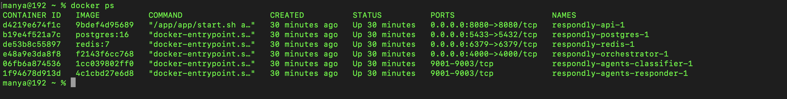
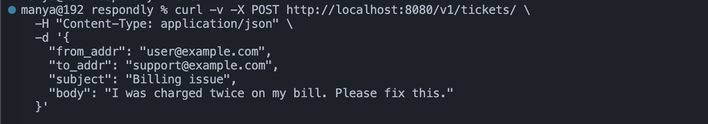
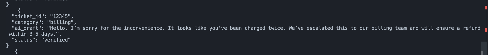

# Respondly – Fast, Friendly, Response-Ready.
## Empathy at Scale for Customer Support 


During my internship at Adobe as an Automation Engineer, I kept running into one truth:
no matter how efficient the backend systems were, what really moved the needle on CSAT wasn’t speed alone, it would be empathy.
A reply that felt human, acknowledged frustration, and guided with care often turned a negative customer experience into loyalty.
That insight sparked Respondly:
a multi-agent AI system that doesn’t just automate tickets, but automates empathy.

## What It Does
● Understands emails → classifies them as Billing, Technical, Account, or General (AGENT 1)

● Writes with care → drafts empathetic replies using Google Gemini (AGENT 2)

● Keeps quality high → verifies tone, compliance & empathy (AGENT 3)

● Works together → agents coordinate seamlessly via orchestration

● Remembers context → all tickets and runs stored in PostgreSQL

## Why Not MCP?
Many would ask why I didn’t just use MCP (Model Context Protocol).
The answer is simple: Respondly is meant to be plug-and-play.
Lightweight → spin it up anywhere with Docker
Modular → scale only the agents you need
Flexible → no protocol overhead or vendor lock-in
Sometimes, the simplest architecture tells the clearest story.

 ## Vision
Respondly isn’t just a project, it’s a stepping stone.
For orgs still relying on human support agents, Respondly can be a co-pilot, suggesting empathetic replies.
For companies that already run fully automated customer service, Respondly becomes the missing empathy layer making bots sound like they care.
It’s built to expand across industries, scaling empathy from startups to global enterprises.

---


## Architecture
backend/: FastAPI API, Celery worker, DB models, migrations.

agents/: Node.js microservices for classifier, responder, and verifier.

orchestration/: Node.js orchestrator service.

docker-compose.yml: Multi-service orchestration.

.env: Environment variables.


 ## Quick Start

#### Build and run all services


docker-compose up --build


---


## API Usage
API → http://localhost:8080

### Create a Support Ticket

Example: 

POST /v1/tickets/
Content-Type: application/json
```
{
  "from_addr": "user@example.com",
  "to_addr": "support@example.com",
  "subject": "Issue with my account",
  "body": "I can't log in to my account."
}
```
### Check API Health
```
GET /healthz
```




---

## Development

### Backend: 
 Python 3.11, FastAPI, SQLAlchemy, Celery

### Agents/Orchestrator:
 Node.js 20, Express, JWT, Gemini SDKs

### Database:
 PostgreSQL 16

### Queue: 
 Redis 7


## Useful Commands
#### Run API only:
```
docker-compose up api
```
##### Run worker only:
```
docker-compose up worker
```
#### Run all services:
```
docker-compose up
```


--- 

Made with ❤️ by Manyolo ⊛


